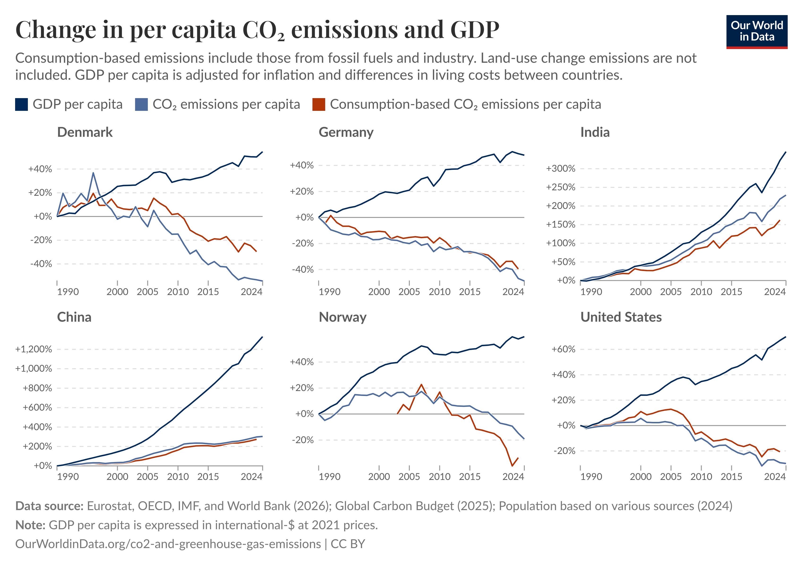

## {.cover-slide}

::: section-label
Volkswirtschaft · Debatte
:::

# Wirtschafts&shy;wachstum {.title-huge}

::: rule
:::

*Pro & Contra — ein wissenschaftlicher Überblick*

---

## Aufhänger {.merkel-slide}

::: section-label
Aufhänger
:::

:::: {.columns}
::: {.column width="30%"}
{.merkel-photo}

::: {.photo-credit}
Angela Merkel
:::
:::

::: {.column width="70%"}
::: merkel-quote
„Ohne Wachstum keine Investitionen, ohne Wachstum keine Arbeitsplätze, ohne Wachstum keine Gelder für die Bildung, ohne Wachstum keine Hilfe für die Schwachen. Und umgekehrt: Mit Wachstum Investitionen, Arbeitsplätze, Gelder für die Bildung, Hilfe für die Schwachen und – am wichtigsten – Vertrauen bei den Menschen."

::: attribution
— Angela Merkel
:::
:::

::: {.rule-full}
:::

::: {.fragment}
Diese Überzeugung teilen viele. Aber was sagt die Wissenschaft dazu — und wo beginnen die Grenzen?
:::
:::
::::

---

## Heute {.agenda-slide}

::: section-label
Aufbau
:::

::: rule
:::

| Nr | Thema |
|----|-------|
| 01 | Was messen wir? BIP als Konzept |
| **02** | **Pro-Wachstum — Argumente & Evidenz** |
| 03 | Contra-Wachstum — Argumente, Evidenz & Datenlage |
| 04 | Globale Perspektive |
| 05 | Implikationen: drei Schulen & Suffizienz |
| 06 | Offene Fragen & Ausblick |

---

## Was messen wir?

::: section-label
01 · Grundlagen
:::

::: rule
:::

:::: {.columns}
::: {.column width="50%"}
**BIP misst…**

- Gesamtwert aller produzierten Güter & Dienstleistungen
- Wachstum = Veränderung des realen BIP pro Kopf
- Standardmaß in Politik & Medien
:::

::: {.column width="50%"}
**BIP misst *nicht*…**

- Unbezahlte Care- und Hausarbeit
- Verteilung von Einkommen und Vermögen
- Ökologische Schäden & Ressourcenverzehr
- Lebenszufriedenheit und Gesundheit
:::
::::

::: rule-full
:::

::: fragment
*Alternativen: Human Development Index (HDI) · Genuine Progress Indicator · Kate Raworths Donut-Ökonomie*
:::

---

## Argumente für Wachstum {.pro-slide}

::: section-label
02 · Pro-Wachstum
:::

::: {.rule style="background:var(--pro);"}
:::

*Zentrale Frage: Was leistet Wachstum?*

::: arg-card
**Materieller Wohlstand & Lebenserwartung**

Mehr Produktion pro Kopf korreliert international eng mit besserer Grundversorgung und höherer Lebenserwartung — besonders bei niedrigen und mittleren Einkommen.

[Evidenz: stark]{.badge .badge-stark}
:::

::: arg-card
**Beschäftigung (Okuns Gesetz)**

Wirtschaftswachstum senkt Arbeitslosigkeit im Schnitt. Der Zusammenhang wird für OECD- und Euroraumländer weiter bestätigt — mit länderspezifischer Stärke.

[Evidenz: solide]{.badge .badge-solide}
:::

::: arg-card
**Sozialstaat finanzieren**

Wachstum verbreitert die Steuer- und Beitragsbasis und entlastet so die Finanzierung von Rente, Gesundheit und Pflege in alternden Gesellschaften.

[Evidenz: solide (kein Ersatz für Reformen)]{.badge .badge-solide}
:::

---

## Argumente für Wachstum (2) {.pro-slide}

::: section-label
02 · Pro-Wachstum
:::

::: {.rule style="background:var(--pro);"}
:::

::: arg-card
**Innovation & Produktivität**

Wachstumserwartungen fördern Investitionen in Forschung, Technik und Produktivität. Der positive Zusammenhang von F&E und Wachstum ist empirisch gut belegt.

[Evidenz: solide]{.badge .badge-solide}
:::

::: arg-card
**Politische Stabilität**

Mit Wachstum lassen sich Verteilungskonflikte leichter entschärfen, weil Zuwächse verteilt werden können, ohne jemandem direkt etwas wegzunehmen.

[Evidenz: plausibel, historisch beobachtbar]{.badge .badge-umstr}
:::

---

## Argumente gegen Wachstum {.contra-slide}

::: section-label
03 · Contra-Wachstum
:::

::: rule
:::

*Zentrale Frage: Was kostet Wachstum — und was übersieht es?*

::: arg-card
**Ökologische Grenzen**

Unendliches Wachstum auf einem endlichen Planeten ist biophysisch problematisch. Absolute Entkopplung von BIP, CO₂ und Materialverbrauch gelingt bisher nicht schnell genug.

[Evidenz: stark (Diagnose); politische Schlussfolgerung umstritten]{.badge .badge-stark}
:::

::: arg-card
**BIP ≠ Wohlbefinden**

Ab hohem Einkommensniveau steigt Lebensqualität nicht automatisch mit weiterem BIP-Wachstum (Easterlin-Paradoxon). Wohlbefinden hängt auch von Gleichheit, Zeitwohlstand und Institutionen ab.

[Evidenz: solide (mit abnehmendem Grenznutzen)]{.badge .badge-solide}
:::

---

## Argumente gegen Wachstum (2) {.contra-slide}

::: section-label
03 · Contra-Wachstum
:::

::: rule
:::

::: arg-card
**Ungleichheit & „Trickle-down"**

Wachstumserträge kommen oft überproportional bei oberen Einkommens- und Vermögensgruppen an. Die Wirtschaft kann wachsen, ohne dass viele Menschen deutlich profitieren.

[Evidenz: solide als Verteilungskritik]{.badge .badge-solide}
:::

::: arg-card
**Unsichtbare Care-Arbeit**

Das BIP erfasst unbezahlte Sorge-, Haus- und Reproduktionsarbeit kaum und unterschätzt damit gesellschaftlich notwendige Arbeit erheblich.

[Evidenz: stark als Messkritik]{.badge .badge-stark}
:::

::: arg-card
**Nord-Süd-Ungleichheit**

Wachstum im globalen Norden beruht häufig auf Rohstoffentnahme und Externalisierung von Umweltkosten — ungleiche Machtverhältnisse im Weltsystem.

[Evidenz: solide als Strukturkritik]{.badge .badge-solide}
:::

---

## BIP und Emissionen: eine hartnäckige Kopplung

::: section-label
03 · Contra-Wachstum — Evidenz
:::

::: rule
:::

:::: {.columns}
::: {.column width="48%"}
**Starke Korrelation zwischen BIP und Verbrauch**

::: chart-wrap
{width="100%"}

::: chart-note
Quelle: IEA · Gräbner-Radkowitsch (2024)
:::
:::
:::

::: {.column width="52%"}
**Absolute Entkopplung bei CO₂ möglich — aber konsumbasiert geringer**

::: chart-wrap
{width="100%"}

::: chart-note
Quelle: Our World in Data · Eurostat, OECD, IMF, World Bank (2026) · CC BY
:::
:::
:::
::::

::: {.fragment}
*Zentrale offene Frage: Ist Entkopplung überall und schnell genug möglich?*
:::

---

## Das verbleibende CO₂-Budget ist sehr klein

::: section-label
03 · Contra-Wachstum — Evidenz
:::

::: rule
:::

:::: {.columns}
::: {.column width="55%"}
::: chart-wrap
{width="100%"}

::: chart-note
Quelle: World Inequality Report 2022 (Chancel et al.)
:::
:::
:::

::: {.column width="45%"}
Das historisch emittierte CO₂ übersteigt das verbleibende Budget für 1,5°C um das **8-fache**.

::: arg-card
Selbst wenn Entkopplung bei CO₂ gelingt: die Geschwindigkeit muss dramatisch höher sein als bisher beobachtet.

[Kernargument der Contra-Seite]{.badge .badge-stark}
:::

::: arg-card
Zugleich: reiche Länder haben historisch überproportional emittiert — das ist auch eine Verteilungsfrage.

[Nord-Süd-Dimension]{.badge .badge-solide}
:::
:::
::::

---

## Technologischer Wandel kann sehr schnell gehen

::: section-label
03 · Contra-Wachstum — Gegenargument
:::

::: rule
:::

:::: {.columns}
::: {.column width="55%"}
::: chart-wrap
{width="100%"}

::: chart-note
Diffusion neuer Infrastrukturen · Quelle: The Breakthrough Effect (2023)
:::
:::

::: chart-wrap
{width="100%"}

::: chart-note
Diffusion neuer Konsumgüter · Quelle: The Breakthrough Effect (2023)
:::
:::
:::

::: {.column width="45%"}
*„Im richtigen Umfeld kann eine Transformation sehr schnell gehen!"*

::: arg-card
**Pro-Wachstum-Lesart**

Historische S-Kurven zeigen: neue Technologien können innerhalb einer Generation zur Normalität werden. Erneuerbare und Elektromobilität folgen demselben Muster.

[Basis für Grünes Wachstum]{.badge .badge-solide}
:::

::: arg-card
**Contra-Lesart**

Frühere Transitionen *ergänzten* bestehenden Verbrauch, sie ersetzten ihn nicht. Die nötige Geschwindigkeit heute ist ohne historisches Vorbild — und das Carbon Budget läuft.

[Offene Frage: schnell genug?]{.badge .badge-umstr}
:::
:::
::::

---

## Wachstum ist nicht gleich Wachstum

::: section-label
04 · Globale Perspektive
:::

::: rule
:::

:::: {.columns}
::: {.column width="50%"}
**Globaler Süden**

- Wachstum oft *notwendig* für Grundversorgung, Gesundheit, Bildung
- Pro-Wachstum-Evidenz hier am stärksten
- Aber: Abhängigkeit von Rohstoffexporten und externen Kapitalflüssen
:::

::: {.column width="50%"}
**Globaler Norden**

- Grundbedürfnisse weitgehend gesichert — abnehmender Grenznutzen
- Ökologische Kosten überproportional hoch
- Sozialstaat-Argument hier besonders relevant
:::
::::

::: rule-full
:::

::: fragment
*Dieselben Argumente tragen unterschiedlich schwer — je nach Ausgangsniveau und Kontext.*
:::

---

## Drei wissenschaftliche Schulen

::: section-label
05 · Implikationen
:::

::: rule
:::

:::: {.columns}
::: {.column width="33%"}
::: {.school-card .school-pro}
**Grünes Wachstum**

Wachstum ist möglich und nötig — aber ökologisch transformiert. Entkopplung durch Technologie & CO₂-Bepreisung.

*OECD, Weltbank, viele Regierungen*
:::
:::

::: {.column width="33%"}
::: {.school-card .school-mid}
**Post-Growth**

Wachstum nicht als Ziel, aber kein aktiver Abbau. Fokus auf Wohlstandsmaße jenseits des BIP.

*Raworth, Jackson, Teile der EU-Forschung*
:::
:::

::: {.column width="33%"}
::: {.school-card .school-contra}
**Degrowth**

Aktive Reduktion des materiellen Durchsatzes in reichen Ländern als ökologische Notwendigkeit.

*Hickel, Kallis, Schmelzer*
:::
:::
::::

::: rule-full
:::

::: fragment
*Alle drei Schulen sind in der Wissenschaft vertreten — die Wahl ist nicht nur empirisch, sondern auch normativ.*
:::

---

## Suffizienz: Verbrauch mitdenken

::: section-label
05 · Implikationen — Suffizienz
:::

::: rule
:::

Effizienz und erneuerbare Energien allein reichen nicht — warum Verbrauchsreduktion politisch relevant bleibt:

::: suf-card
**Sanierung statt nur Neubau fördern**

Der Gebäudebestand verursacht rund 35% der EU-Energienachfrage. Förderprogramme, die Sanierung gleichwertig zum Neubau behandeln, senken Verbrauch ohne Verzicht auf Wohnkomfort — und schaffen Arbeitsplätze im Handwerk.
:::

::: suf-card
**Flächenverbrauch der Erneuerbaren mitdenken**

„Kein CO₂-Ausstoß" heißt nicht „keine ökologischen Kosten": Solar- und Windenergie benötigen erhebliche Flächen — auf Kosten von Biodiversität und Landwirtschaft. Verbrauchsreduktion verkleinert den nötigen Ausbau und schont damit Ökosysteme.
:::

::: suf-card
**Was folgt daraus?**

Grünes Wachstum und Suffizienz schließen sich nicht aus. Aber ohne Nachfrageseite bleibt selbst ambitionierte Energiepolitik hinter den Zielen zurück.
:::

---

## Was bleibt offen?

::: section-label
06 · Ausblick
:::

::: rule
:::

:::: {.columns}
::: {.column width="50%"}
**Empirisch offen**

- Gelingt absolute Entkopplung schnell genug?
- Wie stark ist der Grenznutzen von Wachstum bei hohem Einkommen?
- Welche Wachstumstypen reduzieren Ungleichheit?
:::

::: {.column width="50%"}
**Normativ offen**

- Wie viel ökologisches Risiko ist vertretbar?
- Wessen Wohlstand zählt — und über welchen Zeitraum?
- Was schulden reiche Länder dem globalen Süden?
:::
::::

::: rule-full
:::

::: {.formula-box .fragment}
Die **Pro-Seite** fragt: *Was leistet Wachstum?*

Die **Contra-Seite** fragt: *Was kostet Wachstum — und was übersieht es?*

Beide Fragen sind wissenschaftlich legitim.
:::

---

## {.schluss-slide}

::: section-label
Fazit
:::

# Kein einfaches Ja oder Nein. {.title-huge}

::: rule
:::

Wachstum kann Wohlstand schaffen — und Wohlstand zerstören. Die Wissenschaft liefert Evidenz für beides. Welche Schlüsse wir daraus ziehen, ist eine gesellschaftliche Entscheidung.

::: rule-full
:::

*Fragen & Diskussion*
