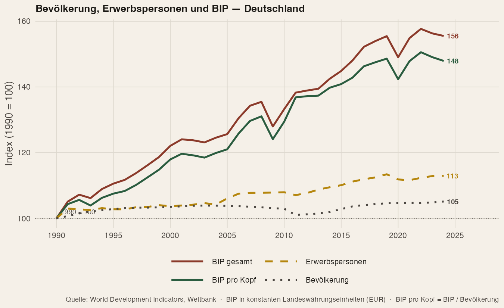
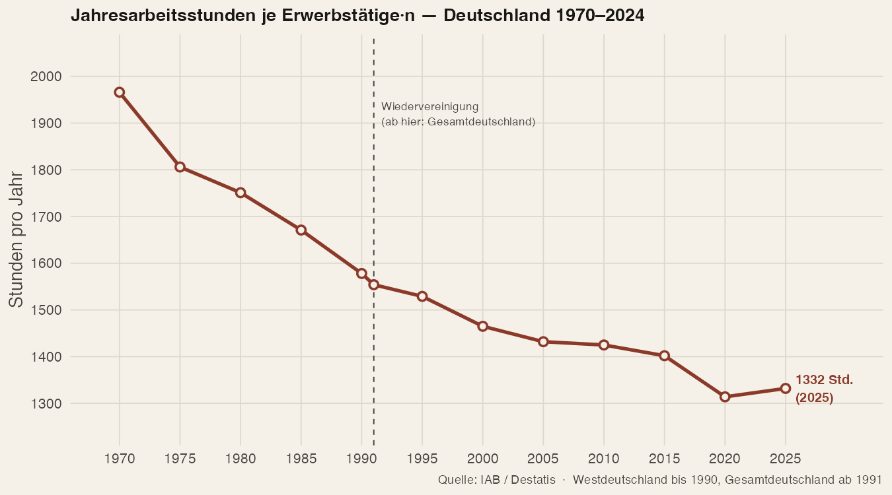

## Wachstum als Notwendigkeit {.merkel-slide}

::: section-label
Aufhänger
:::

:::: {.columns}
::: {.column width="30%"}
{.merkel-photo}
:::

::: {.column width="70%"}
::: merkel-quote
„Ohne Wachstum keine Investitionen, ohne Wachstum keine Arbeitsplätze, ohne Wachstum keine Gelder für die Bildung, ohne Wachstum keine Hilfe für die Schwachen. Und umgekehrt: Mit Wachstum Investitionen, Arbeitsplätze, Gelder für die Bildung, Hilfe für die Schwachen und – am wichtigsten – Vertrauen bei den Menschen."

::: attribution
— Angela Merkel
:::
:::

::: {.rule-full}
:::

::: {.fragment}
Diese Überzeugung teilen viele. Aber was sagt die Wissenschaft dazu? 
Und gibt es auf einem endlichen Planeten nicht auch Grenzen des Wachstums?
:::
:::
::::

---

## Wachstum als politischer Konsens? {.merkel-slide}

::: section-label
Aufhänger
:::

:::: {.columns}
::: {.column width="38%"}
::: {.fragment .merkel-quote data-fragment-index="1"}
„Wir brauchen Wachstum. Ohne Wachstum gibt es keine guten Löhne, keine Sicherheit für die Sozialsysteme. Wachstum ist die Schicksalsfrage unserer Nation. 2026 muss das Jahr des Wachstums werden."

::: attribution
— Jens Spahn (CDU) · Bundestag, 29.12.2025
:::
:::
:::

::: {.column width="12%"}
::: {.fragment data-fragment-index="1"}
{style="width:100%; border-radius:4px;"}
:::
:::

::: {.column width="12%"}
::: {.fragment data-fragment-index="2"}
{style="width:100%; border-radius:4px;"}
:::
:::

::: {.column width="38%"}
::: {.fragment .merkel-quote data-fragment-index="2"}
„Ich bin auch bei einer Wirtschaftswende dabei; 0,3 Prozent reicht mir auch nicht."

::: attribution
— Katharina Beck (Grüne) · Bundestag, 26.04.2024
:::
:::
:::
::::

::: {.rule-full}
:::

---

## Aufbau {.agenda-slide}

::: section-label
Aufbau
:::

::: rule
:::

| Nr | Thema |
|----|-------|
| 01 | Was messen wir? BIP als Konzept |
| 02 | Pro-Wachstum — Argumente & Evidenz |
| 03 | Contra-Wachstum — Argumente, Evidenz & Datenlage |
| 04 | Diskussion: drei Schulen, Suffizienz & Wachstumszwang |
| 05 | Fazit |
|  — | **Anhang**: vertiefendes Material (BIP · Ökologie · Suffizienz · Wachstumszwang) |

---

## Wachstum ≠ BIP: Zwei Ebenen der Wachstumskritik

::: section-label
01 · Grundlagen
:::

::: rule
:::

:::{.incremental}
- **Wirtschaftswachstum**: „Steigerung der Quantität und Qualität der wirtschaftlichen Güter und Dienstleistungen, die eine Gesellschaft produziert." (Roser, 2021)
- **Bruttoinlandsprodukt (BIP)**: der monetäre Wert aller Endgüter und Dienstleistungen im Inland
:::

::: {.fragment .arg-card}
**Wichtige aber weniger bekannte Einschränkung:**

- BIP-Wachstum pro Kopf ist ein gewichteter Durchschnitt
- Bildet Einkommensgewinne der Wohlhabenden überproportional ab

[Schulte, ifso 2023]{.badge .badge-umstr}
:::

::: {.fragment .formula-box}
**Zwei Ebenen der Kritik:**

- **BIP-Kritik** = Messproblem: Care-Arbeit, Umweltschäden u.a. fehlen im Maß.
- **Wachstumskritik** = Fundamentalkritik: Selbst ein perfektes Öko-BIP stößt auf einem endlichen Planeten an materielle Grenzen.
:::

---

# Argumente für Wachstum {.pro-slide}

## Materieller Wohlstand {.pro-slide}

::: section-label
02 · Pro-Wachstum · Argument 1
:::

::: {.rule style="background:var(--pro);"}
:::

{width="80%"}

::: {.arg-card .fragment}
Mehr Produktion pro Kopf _korreliert_ mit besserer Grundversorgung — besonders bei niedrigen und mittleren Einkommen.

[Evidenz: stark]{.badge .badge-stark}
:::

---

## Lebenszufriedenheit {.pro-slide}

::: section-label
02 · Pro-Wachstum · Argument 1 (Forts.)
:::

::: {.rule style="background:var(--pro);"}
:::

{width="80%"}

::: {.fragment .arg-card}
Höheres BIP pro Kopf $\leftrightarrow$ höhere Lebenszufriedenheit.

[Evidenz: solide]{.badge .badge-solide}
:::

::: {.fragment .arg-card}
**Einschränkung:** Kausalität zwischen Glück und Einkommen empirisch umstritten.

[Killingsworth el al. (2023)]{.badge .badge-umstr}
:::

---

## Wachstum als Mittel oder Zweck? {.pro-slide}

::: section-label
02 · Pro-Wachstum · Argument 1 (Forts.)
:::

::: {style="text-align: center; margin-top: 0.5em;"}
{width="45%"}
:::

---

## Sozialstaat {.pro-slide}

::: section-label
02 · Pro-Wachstum · Argument 4
:::

::: {.rule style="background:var(--pro);"}
:::

:::: {.columns}
::: {.column width="52%"}
::: arg-card
**Sozialstaat finanzieren**

Wachstum $\uparrow \rightarrow$ Steuer- und Beitragsbasis $\uparrow$ 

[Evidenz: solide (kein Ersatz für Reformen)]{.badge .badge-solide}

::: {.fragment data-fragment-index="2"}
- Wachstumsunabhängige(re) Alternativen: Vermögenssteuern, Erbschaftsteuern, Wertschöpfungsabgabe, ...
:::

::: {.fragment data-fragment-index="3"}
- Verdeutlicht: verteilungspolitische Dimension
:::

:::
:::

::: {.column width="48%"}
::: {.fragment .merkel-quote data-fragment-index="1"}
„Staatliche Leistungen wie Bürgergeld, Wohngeld, Elterngeld, BAföG werden wir absehbar nicht erhöhen können, in manchen Bereichen müssen wir sparen — jedenfalls solange wir kein Wachstum haben."

::: attribution
— Jens Spahn (CDU)
:::
:::
:::
::::

::: {.fragment .chart-note}
Daten Deutschland: Destatis Sozialleistungen · BMAS Sozialbudget · OECD SOCX Database · Bundesagentur für Arbeit ba-statistik.de
:::

# Argumente gegen Wachstum {.contra-slide}

## BIP ≠ Wohlbefinden {.contra-slide}

::: section-label
03 · Contra-Wachstum · Argument 1
:::

::: rule
:::

{width="100%"}

::: {.fragment .arg-card}
Wohlbefinden hängt auch von Gleichheit, Sozialsystemen und Institutionen ab.

[Evidenz: solide]{.badge .badge-solide}
:::

---

## Argumente gegen Wachstum (2) {.contra-slide}

::: section-label
03 · Contra-Wachstum
:::

::: rule
:::

::: {.fragment .arg-card}
**Ungleichheit & „Trickle-down"**

* Wachstumserträge gehen an obere Einkommens- und Vermögensgruppen $\rightarrow$ Stabilisierung von Ungleichheit

[Evidenz: solide]{.badge .badge-solide}
:::

::: {.fragment .arg-card}
**Nord-Süd-Ungleichheit**

* Wachstum im globalen Norden $\leftrightarrow$ Rohstoffentnahme und Externalisierung von Umweltkosten 
* Ungleiche Machtverhältnisse im Weltsystem.

[Evidenz: solide]{.badge .badge-solide}
:::

::: {.fragment .arg-card}
**Das Mittel wird leicht zum Zweck**

* Ausweitung der Arbeitszeit $\rightarrow$ Wachstum  
* Ab bestimmtem Umfang sinkt das Wohlbefinden $\rightarrow$ Wachstum wird zum Selbstzweck
* Beispiel: Abschaffung von Feiertagen als Wachstums-Booster

[Zeitwohlstand-Forschung]{.badge .badge-stark}
:::

---

## Ökologische Grenzen: BIP und Emissionen {.contra-slide}

::: section-label
03 · Contra-Wachstum · Argument 2 — Ökologische Grenzen
:::

::: rule
:::

:::: {.columns}
::: {.column width="42%"}
::: chart-wrap
{width="100%"}

::: chart-note
Quelle: IEA · Gräbner-Radkowitsch (2024)
:::
:::
:::

::: {.fragment .column width="58%"}
::: chart-wrap
{width="100%"}
:::
:::
::::

::: {.fragment}
*Zentrale offene Frage: Ist Entkopplung überall und schnell genug möglich?*
:::

---

# Implikationen

## Ganz ohne Suffizienz wird es nicht gehen

::: section-label
04 · Diskussion — Suffizienz
:::

::: rule
:::

Effizienz und erneuerbare Energien allein reichen nicht $\rightarrow$ Verbrauchsreduktion politisch undankbar, aber notwendig

::: {.fragment .suf-card}
**Sanierung statt nur Neubau fördern**

* Gebäudebestand: 35 % der EU-Energienachfrage
* Sanierung bei Förderprogrammen gleichwertig zum Neubau behandeln
* CLEVER: Tiefensanierungspflicht als Schlüsselhebel im Gebäudesektor
:::

::: {.fragment .suf-card}
**Mobilität: weniger Kilometer, nicht nur sauberere Autos**

* Verlagerung von Pkw & Flug zu Bahn & aktiver Mobilität
* CLEVER modelliert Konvergenz auf ~10.000–15.000 km/Person/Jahr (aktuell bis 20.000+)
* Flächenverbrauch neuer Infrastruktur und Biodiversitätskosten mitdenken
:::

::: {.fragment .suf-card}
**Was folgt daraus?**

* Grünes Wachstum und Suffizienz schließen sich nicht aus $\rightarrow$ konsistente Maßnahmenpakete existieren
* CLEVER (2023): −20 % bis −30 % EU-Endenergie durch Suffizienz allein erreichbar

[Nature Communications 2024]{.badge .badge-solide}
:::

---

## Drei wissenschaftliche Schulen

::: rule
:::

:::: {.columns}
::: {.column width="33%"}
::: {.fragment .school-card .school-pro}
**Grünes Wachstum**

Wachstum ist möglich und nötig — aber ökologisch transformiert. Entkopplung durch Technologie & CO₂-Bepreisung.

*OECD, Weltbank, viele Regierungen*
:::
:::

::: {.column width="33%"}
::: {.fragment .school-card .school-mid}
**A-Growth**

Wachstum nicht als Ziel, aber kein aktiver Abbau. Fokus auf Wohlstandsmaße jenseits des BIP.

*Raworth, Jackson, Teile der EU-Forschung*
:::
:::

::: {.column width="33%"}
::: {.fragment .school-card .school-contra}
**Postwachstum/Degrowth**

Aktive Reduktion des materiellen Durchsatzes in reichen Ländern als ökologische Notwendigkeit.

*Hickel, Kallis, Schmelzer*

:::
:::
::::

::: rule-full
:::

::: fragment
*Alle drei Schulen sind in der Wissenschaft vertreten — die Wahl ist nicht nur empirisch, sondern auch normativ.*
:::

---

## Wachstumszwänge?

::: section-label
04 · Diskussion — Wachstumszwang
:::

::: rule
:::

- Wenn wir im globalen Norden mit dem auskämen was wir haben - warum sollte es Wachstum brauchen?

. . .

**Ökonomische Zwänge**
[Teils kontrovers]{.badge .badge-umstr}

:::{.incremental}
- **Produktivitätsfalle:** Technischer Fortschritt, kein Wachstum $\rightarrow$ weniger Arbeit
- **Institutionen-Design:** Gerade bei alternender Gesellschaft brauchen Sicherungssysteme Zuschüsse
- **Profit- und Statuslogik:** Unternehmen mit geringerem Gewinn gehen im Wettbewerb unter, Menschen motiviert relativ aufzusteigen 
:::

. . .

**Politische 'Zwänge'**
[Recht breit akzeptiert]{.badge .badge-solide}

:::{.incremental}
- Wachstum **vertagt** Verteilungskonflikte — alle können gewinnen
- Stagnation macht Umverteilung **zwingend** — jemand muss abgeben
:::

::: {.fragment .formula-box}
→ **Wachstumspolitik ist immer auch Verteilungspolitik**
:::

::: rule-full
:::

---

## {.schluss-slide}

::: section-label
Fazit
:::

# Mein Fazit {.title-large}

::: rule
:::

:::{.incremental}
- Größte Gefahr: Wachstum wird vom Mittel zum Selbstzweck
- Verteilung und Machtfragen **zentral** — aber in der Wachstumsdebatte oft unterbelichtet
- Wachstumskritik ohne Verteilungsantwort und (pragmatische) Umsetzungsstrategie liefert **keine** politische Handlungsleitung
- Ökologische Transformation muss **sozial abgefedert** werden — sonst keine Mehrheit und keine Umsetzung
- Es geht auch um die Frage wie wir leben wollen $\rightarrow$ Wissenschaft kann und darf keine finalen Antworten liefern
:::

::: rule-full
:::

*Fragen & Diskussion*

# Weiterführende Literatur für Interessierte

## Zum Weiterlesen I {.smaller}
### Grundbegriffe & Einstieg

- Gräbner-Radkowitsch, C., & Schmelzer, M. (2026). Was ist Wachstum? In *Grundfragen der Ökonomie* (S. 67–81). Schäffer-Poeschel.
  - *Ein aktueller, pointierter Überblick: Was genau meinen wir eigentlich, wenn wir von ökonomischem Wachstum sprechen?*

- Schmelzer, M. & Vetter, A. (2019). *Degrowth/Postwachstum zur Einführung*. Junius.
  - *Der kompakteste Einstieg: sieben Formen der Wachstumskritik, von ökologisch bis feministisch.*

- Binswanger, M. (2019). *Der Wachstumszwang: Warum die Volkswirtschaft immer weiterwachsen muss, selbst wenn wir genug haben*. Wiley-VCH.
  - *Diskutiert, warum das heutige Wirtschaftssystem strukturell auf Wachstum angewiesen ist — und was das für uns bedeutet.*

- Jackson, T. (2017). *Wohlstand ohne Wachstum – das Update*. oekom.
  - *Die „Bibel der Wachstumskritik" in erweiterter Neuauflage: Was ist Wohlstand ohne Wachstum — und wie kämen wir dorthin?*

### Einkommen, Wachstum und Glücksempfinden

- Easterlin, R. (1974). Does economic growth improve the human lot? *Nations and Households in Economic Growth*, 89–125.
  - *Das Original: Innerhalb eines Landes macht Geld glücklicher — aber wächst das Land insgesamt, steigt das Glück langfristig kaum.*

- Killingsworth, M. A., Kahneman, D. & Mellers, B. (2023). Income and emotional well-being: A conflict resolved. *PNAS, 120*(10). <https://doi.org/10.1073/pnas.2208661120>
  - *Löst den scheinbaren Widerspruch zwischen Easterlin und neueren Studien auf: Geld macht scheinbar wirklich glücklicher — aber es ist nur ein Puzzlestück unter vielem.*

- Clark, A. E., Frijters, P. & Shields, M. A. (2008). Relative income, happiness, and utility. *Journal of Economic Literature, 46*(1), 95–144.
  - *Warum sozialer Vergleich erklärt, dass absolutes Einkommenswachstum langfristig keine Glücksdividende liefert.*

## Zum Weiterlesen II {.smaller}

### Alternativen, Kompromisse & Globale Sicht

- Umweltbundesamt (2018). *Gesellschaftliches Wohlergehen innerhalb planetarer Grenzen: Der Ansatz einer vorsorgeorientierten Postwachstumsposition*.
  - *Ein pragmatischer Kompromiss: Wie Institutionen so umgebaut werden können, dass sie gut funktionieren, unabhängig davon, ob die Wirtschaft wächst oder nicht.*

- Gräbner-Radkowitsch, C., & Strunk, B. (2023). Degrowth and the Global South: The twin problem of global dependencies. *Ecological Economics, 213*.
  - *Beleuchtet kritisch, wie ein Postwachstumspfad im globalen Norden die wirtschaftlichen Abhängigkeiten des globalen Südens beeinflusst.*

- Raworth, K. (2018). *Die Donut-Ökonomie*. Hanser.
  - *Praktisches Rahmenmodell: Wirtschaft zwischen sozialem Fundament und planetaren Grenzen — visuell und zugänglich.*

- Sen, A. (1999). *Development as Freedom*. Oxford UP.
  - *Der Capability-Ansatz: Wohlstand ist nicht Geld, sondern reale Verwirklichungschancen — das normative Fundament neben dem Wachstum.*

- Coyle, D. (2025). *The Measure of Progress: Counting What Really Matters*. Cambridge UP.
  - *Warum das BIP für eine Digitalwirtschaft mit unsichtbaren Werten nicht mehr taugt — und was stattdessen zählen sollte.*

  
  
## Zum Weiterlesen III {.smaller}

### Suffizienz & Energiepolitik

- Gräbner-Radkowitsch, C., Lage, J., & Wiese, F. (2022, 20. Juni). Zur ökonomischen Bedeutung von Suffizienz. *Makronom – Online Magazin für Wirtschaftspolitik*. <https://makronom.de/zur-oekonomischen-bedeutung-von-suffizienz-42099>
  - *Zugängliche Einführung in die ökonomischen Grundlagen von Suffizienz: Warum ist Suffizienz wirtschaftlich sinnvoll — und was unterscheidet sie von bloßem Konsumverzicht?*

- négaWatt Association et al. (2023). *CLEVER — A Collaborative Low Energy Vision for the European Region: Final Report*. <https://clever-energy-scenario.eu>
  - *Das umfassendste Bottom-up-Szenario für eine suffiziente Energiewende in Europa: quantifiziert, wie −55 % Endenergie bis 2050 durch Suffizienz, Effizienz und Erneuerbare erreichbar sind — ohne CCS.*

- Samadi, S., Lechtenböhmer, S. et al. (2024). Towards a low-energy demand future: The CLEVER scenario for Europe. *Nature Communications*.
  - *Peer-reviewed Version des CLEVER-Szenarios: −20 % bis −30 % Endenergie allein durch Suffizienzmaßnahmen in Deutschland, Frankreich und UK.*

### Arbeitszeit & Produktivität

- Backmann, J., Hoch, F., Hüby, J., Platz, M., & Sinnemann, M. F. (2026). *Die 4-Tage-Woche in Deutschland: Ein Follow-Up zwei Jahre nach dem Start der Pilotstudie*. Intraprenör, Berlin. <https://www.4tagewoche.org>
  - *Follow-Up-Studie (n=45 Organisationen): 70 % führen Arbeitszeitreduzierung fort; Finanzkennzahlen stabil, 94 % bessere Work-Life-Balance, 74 % höhere Innovation & Kreativität. Wichtige Einschränkung: kein Rückgang der Fehlzeiten nachweisbar, Übergangsrisiken dokumentiert.*

# Anhang

## Anhang: Übersicht {.smaller}

::: section-label
Anhang
:::

::: rule
:::

| | Abschnitt | Inhalt |
|---|---|---|
| **A** | Das Bruttoinlandsprodukt | Definition, Berechnungsarten, Bevölkerung & Arbeitszeit |
| **B** | Ökologische Grenzen | CO₂-Budget und Technologiewandel |
| **C** | Suffizienz | Was ist das? Wie konsistent integrieren? |
| **D** | Wachstumszwänge | Mechanismen, Fiskallogik & Alternativen |

---

# A · Das Bruttoinlandsprodukt

## Was misst das BIP?

::: section-label
Anhang A · Das BIP — Definition
:::

::: rule
:::

:::: {.columns}
::: {.column width="55%"}
::: arg-card
**Das BIP misst…** den monetären Wert aller Endgüter und Dienstleistungen, die innerhalb eines Landes in einem Jahr produziert werden.

- *Inlandsprinzip*: alle im Inland produzierten Güter, unabhängig von Nationalität der Produzierenden
- *Endprodukte*: Vorleistungen werden abgezogen (keine Doppelzählung)
- *Aggregation über Geldwert*: einziger gemeinsamer Nenner für heterogene Güter
:::
:::

::: {.column width="45%"}
::: {.fragment .formula-box}
1 Jahr Altenpflege (100 €) + 2 Solarpanele (150 €) + 5 GB Daten (100 €) **= 350 € BIP**

→ Aggregation nur über Marktpreise möglich
:::

::: {.fragment .arg-card}
**Nominales vs. reales BIP**

BIP kann steigen, weil *mehr produziert* wurde — oder weil *Preise gestiegen* sind. 
Für Wachstumsvergleiche zählt das **reale**, also inflationsbereinigte, BIP.
:::
:::
::::

---

## Die drei Berechnungsarten

::: section-label
Anhang A · Das BIP — Berechnungsarten
:::

::: rule
:::

:::: {.columns}
::: {.column width="33%"}
::: {.school-card .school-pro}
**Entstehungsrechnung**

*Angebotsseite*

$$Y = Prod - VL - Sub + T$$

BIP als **Wert aller Endprodukte** — Produktionswert minus Vorleistungen, bereinigt um Subventionen und Steuern.
:::
:::

::: {.column width="33%"}
::: {.school-card .school-mid}
**Verwendungsrechnung**

*Nachfrageseite*

$$Y = C + I + G + X$$

BIP als **Summe aller Ausgaben** — Konsum, Investitionen, Staatsausgaben, Nettoexporte.
:::
:::

::: {.column width="33%"}
::: {.school-card .school-contra}
**Verteilungsrechnung**

*Einkommensseite*

$$Y = W + P + T + A - X$$

BIP als **Summe aller Einkommen** — Löhne, Gewinne, Steuern, Abschreibungen, minus Auslandseinkommen.
:::
:::
::::

::: {.fragment .formula-box}
Alle drei Verfahren führen zum **gleichen Ergebnis** — drei Perspektiven auf denselben wirtschaftlichen Kreislauf.
:::

---

## Was erhöht das BIP — was fehlt darin?

::: section-label
Anhang A · Das BIP — Grenzen & Staatsanteil
:::

::: rule
:::

:::: {.columns}
::: {.column width="48%"}
::: arg-card
**Erhöht das BIP ↑**

- Rüstungsausgaben, Reparaturen nach Unfällen
- Werbung & geplante Obsoleszenz
- Neubau (auch wenn Sanierung effizienter wäre)
- Überstunden & Arbeitszeitverlängerungen
:::

::: {.fragment .arg-card}
**Die Rolle öffentlicher Aktivitäten**

In der Verwendungsrechnung ist $G$ (Staatsausgaben) einer der **vier zentralen Bestandteile** — ca. **20 % des deutschen BIP** (2018). Staatliche Leistungen gehen über Produktionskosten ein, da keine Marktpreise existieren.

[Kuznets-Warnung: wofür nutzen wir das BIP?]{.badge .badge-umstr}
:::

::: {.fragment .formula-box}
→ Sparpolitik (Kürzung $G$) dämpft das BIP direkt — die Wachstumsdebatte ist immer auch Haushaltsdebatte.
:::
:::

::: {.column width="48%"}
::: {.fragment .arg-card}
**Fehlt im BIP ↓**

- Unbezahlte Care- und Hausarbeit
- Ehrenamt und Nachbarschaftshilfe
- Naturkapital und ökologische Schäden
- Einkommens- und Vermögensverteilung
- Lebenszufriedenheit und Gesundheit
:::

::: {.fragment .chart-note}
*Alternativen: Human Development Index (HDI) · Genuine Progress Indicator · Donut-Ökonomie (Raworth) · Beyond-GDP (EU)*
:::
:::
::::

---

## Bevölkerungswachstum und BIP

::: section-label
Anhang A · Das BIP — Bevölkerung & Wachstum
:::

::: rule
:::

:::: {.columns}
::: {.column width="60%"}
::: chart-wrap
{width="100%"}

::: chart-note
Quelle: World Development Indicators, Weltbank · BIP in konstanten EUR · BIP pro Kopf = BIP / Bevölkerung
:::
:::
:::

::: {.column width="40%"}
::: {.fragment .arg-card}
**Aggregat ≠ Lebensstandard**

Bevölkerungswachstum erhöht das Gesamt-BIP automatisch — mehr Arbeitende, mehr Nachfrage.

Für den Lebensstandard entscheidend: **BIP pro Kopf**.

*Demografische Dividende*: viele Erwerbstätige, wenig Abhängige → günstigste Wachstumsphase.
:::

::: {.fragment .arg-card}
**Implikation Deutschland**

- Bevölkerung +5 %, BIP pro Kopf +48 % (seit 1990)
- Wachstum fast ausschließlich durch **Produktivität**
- Pro-Kopf-Wohlstand erfordert Innovation, nicht nur mehr Menschen
:::
:::
::::

---

## Arbeitszeit und BIP (1970–2025)

::: section-label
Anhang A · Das BIP — Arbeitszeit & Produktivität
:::

::: rule
:::

:::: {.columns}
::: {.column width="55%"}
::: chart-wrap
{width="100%"}

::: chart-note
Quelle: IAB / Destatis · Westdeutschland bis 1990, Gesamtdeutschland ab 1991
:::
:::

::: {.fragment .formula-box}
**BIP-Zerlegung:**
$$Y = \frac{Y}{h} \cdot \frac{h}{E} \cdot E$$
Stundenproduktivität × Stunden je Erwerbstätige·r × Erwerbstätige
:::
:::

::: {.column width="45%"}
::: {.fragment .arg-card}
**Drei Mechanismen**

- *Einkommenseffekt*: mehr Wohlstand → mehr Freizeit
- *Substitutionseffekt*: höhere Löhne → Arbeit attraktiver
- *Produktivitätsrückkopplung*: kürzere Zeiten → weniger Ermüdung → höhere Stundenleistung
:::

::: {.fragment .arg-card}
**Kernbefunde**

- −630 Std./Jahr seit 1970 (−32 %) — trotz gestiegenem BIP pro Kopf
- Kurze Arbeitszeit ↔ hohe Stundenproduktivität: negativer Zusammenhang in Europa [Evidenz: solide, aber wenig Studien für d]{.badge .badge-solide}
- 4-Tage-Woche DE Follow-Up (2026, n=45 Org.): 70 % führen Arbeitszeitreduzierung nach Pilotstudie fort; Finanzkennzahlen stabil, 94 % berichten bessere Work-Life-Balance [Backmann et al. 2026](https://www.wiwi.uni-muenster.de/tow/sites/tow/files/downloads/4DW_FollowUp_Report_Deutsch.pdf){.badge .badge-solide}
- **„Mehr Arbeit = mehr Wachstum"** empirisch nicht haltbar
:::
:::
::::

---

# B · Ökologische Grenzen: Evidenz und Dynamik

## Das verbleibende CO₂-Budget ist sehr klein {.contra-slide}

::: section-label
Anhang B · Ökologische Grenzen — CO₂-Budget
:::

::: rule
:::

:::: {.columns}
::: {.column width="55%"}
::: chart-wrap
{width="100%"}

::: chart-note
Quelle: World Inequality Report 2022 (Chancel et al.)
:::
:::
:::

::: {.column width="45%"}

::: {.fragment .arg-card}
Reiche Länder haben historisch überproportional emittiert $\rightarrow$ Gerechtigkeitsfrage.

[Nord-Süd-Dimension]{.badge .badge-solide}
:::

::: {.fragment .arg-card}
Selbst wenn Entkopplung gelingt: Geschwindigkeit muss dramatisch steigen.

[Kernargument]{.badge .badge-stark}
:::

::: {.fragment .arg-card}
Gilt aber auch für politische Prozesse hin zu einer möglichen Postwachstumsgesellschaft!
:::

:::
::::

---

## Aber: Technologischer Wandel kann sehr schnell gehen {.contra-slide}

::: section-label
Anhang B · Ökologische Grenzen — Technologiedynamik
:::

::: rule
:::

:::: {.columns}
::: {.column width="55%"}
::: chart-wrap
{width="78%"}
:::

::: chart-wrap
{width="78%"}
:::
:::

::: {.column width="45%"}
::: {.fragment .arg-card}
**Pro-Wachstum-Lesart**

Historische S-Kurven zeigen: neue Technologien können innerhalb einer Generation zur Normalität werden.

[Basis für Grünes Wachstum]{.badge .badge-solide}
:::

::: {.fragment .arg-card}
**Contra-Lesart**

Frühere Transitionen *ergänzten* bestehenden Verbrauch, sie ersetzten ihn nicht. Verteilungskonflike noch nie so virulent.

[Offene Frage: schnell genug?]{.badge .badge-umstr}
:::

- Technologiewandel und Suffizienz sind komplementär: Effizienz verringert den Transformationsbedarf — zusammen realistischer als jedes Instrument allein

:::
::::

---

# C · Suffizienz

## Was ist Suffizienz?

::: section-label
Anhang C · Suffizienz — Definition
:::

::: rule
:::

:::: {.columns}
::: {.column width="50%"}
::: formula-box
**Drei Hebel der Dekarbonisierung**

🔋 **Erneuerbare** → Versorgung dekarbonisieren 
⚙️ **Effizienz** → gleicher Nutzen mit weniger Energie 
🌿 **Suffizienz** → Nachfrage auf ein nachhaltiges Niveau ausrichten

*CLEVER-Ansatz: Suffizienz zuerst definieren — dann Effizienz — dann Erneuerbare*
:::

::: {.fragment .arg-card}
Suffizienz fragt: **Was brauchen wir wirklich, um gut zu leben?**

Nicht Askese — sondern: Mindest- und Höchstkorridore für Konsum definieren.

*Equity-Dimension*: ärmere Länder erhöhen Verbrauch, reichere reduzieren → Konvergenz auf nachhaltigem Niveau.
:::
:::

::: {.column width="50%"}
::: {.fragment .arg-card}
**Sektoren-Beispiele (CLEVER)**

🏠 **Wohnen**: Wohnfläche pro Kopf begrenzen [häufiger Vorschlag — praktisch und normativ nicht trivial]{.badge .badge-umstr}; Sanierung statt Neubau 
🚆 **Mobilität**: Reisekilometer reduzieren; Verlagerung von Luft & Pkw zu Schiene & aktiver Mobilität 
🏭 **Industrie**: Kreislaufwirtschaft eliminiert Bedarf an CCS-Technologien
:::

::: {.fragment .arg-card}
**Quantifizierung EU** (CLEVER Final Report 2023):

**−20 % bis −30 %** des Endenergieverbrauchs allein durch Suffizienz erreichbar (quantifiziert für Deutschland, Frankreich, UK)

[Nature Communications 2024]{.badge .badge-stark}
:::
:::
::::

---

## Suffizienz im Maßnahmenkoffer

::: section-label
Anhang C · Suffizienz — Integration
:::

::: rule
:::

Suffizienz ist kein Gegensatz zu bestehenden Maßnahmen — sie macht sie **konsistenter und wirksamer**:

:::: {.columns}
::: {.column width="33%"}
::: suf-card
**Preise richtig setzen**

- CO₂-Preis nur mit Rückverteilung — sonst regressiv
- Klimabonus AT: 98% automatisch, regional gestaffelt
- Dienstwagenprivileg: −690 €/t CO₂ — 16× CO₂-Preis (Ariadne 2024)

*Suffizienz-Konsistenz*: sufficienzhemmende Subventionen abbauen (Neubaubonus, Dienstwagenregel, Dieselprivileg)
:::
:::

::: {.column width="33%"}
::: suf-card
**Nachfrage gestalten**

- Right to Repair: EU-Recht seit Juli 2024
- Fossil-Werbeverbot: Amsterdam 2026, Spanien 2025

*Suffizienz-Konsistenz*: CLEVER-Mobilitätskorridore (~10.000–15.000 km/Person/Jahr); Wohnflächenanreize weg von reinen Neubauvorteilen

[CLEVER 2023]{.badge .badge-solide}
:::
:::

::: {.column width="33%"}
::: suf-card
**Standards setzen**

- CLEVER: −55% EU-Endenergie bis 2050 nur mit Suffizienz als gleichwertigem Hebel realistisch

*Suffizienz-Konsistenz*: Gebäuderichtlinie (EPBD) mit Tiefensanierungspflicht; nationale Energiepläne (NECPs) mit eigenem Suffizienz-Kapitel

[CLEVER 2023 · EU-Kommission]{.badge .badge-solide}
:::
:::

::::

::: notes
**Zur Einordnung**
Diese Maßnahmen sind wachstumsagnostisch — sie funktionieren unabhängig davon ob die Wirtschaft wächst oder schrumpft. Sie verbinden ökologische Wirkung mit sozialer Abfederung. Keine Parteiempfehlung — Frage ist: Was wäre mit den Zielen konsistent?

**Preise richtig setzen**

CO₂-Preis + Rückverteilung: Ohne Rückverteilung regressiv — ärmere Haushalte zahlen proportional mehr. RWI/FinanzArchiv: Per-capita Rückverteilung kehrt den Effekt vollständig um.

Klimabonus Österreich: Seit Oktober 2022. Geografisch gestaffelt — schlechter ÖPNV = höhere Zahlung. 98% automatisch ausgezahlt. OECD 2024 nennt es explizit als Referenzmodell. Deutsches Klimageld nie umgesetzt — Ampel zerbrach vorher.

Dienstwagenprivileg −690 €/t: Ariadne-Methodik (Kopernikus/DIW 2024) — Subvention wird in äquivalenten CO₂-Preis umgerechnet. Ergebnis: wirkt 16× stärker in die falsche Richtung als der CO₂-Preis in die richtige. Fiskalkosten ~6 Mrd. €/Jahr, begünstigt primär hohe Einkommen.

Pendler-/Dieselprivileg: UBA identifiziert ~65 Mrd. €/Jahr umweltschädliche Subventionen gesamt. Dieselprivileg ~9,5 Mrd., Pendlerpauschale >5 Mrd. Ariadne-Äquivalent Pendlerpauschale: −70 bis −250 €/t CO₂. CDU/SPD haben Pendlerpauschale trotzdem erhöht — Kritik von DUH und Umweltökonomen.

**Nachfrage gestalten**

CLEVER-Szenario: Wuppertal Institut + Öko-Institut + 13 Partner, Nature Communications 2024. 50% EU-Endenergiereduktion bis 2050 — ≥40% davon allein durch Suffizienz, nicht Technologie. Ohne Suffizienz: CCS-Abhängigkeit oder massive Importabhängigkeit unvermeidbar.

CLEVER-Mobilitätskorridore: Konvergenz auf ca. 10.000–15.000 km Personenverkehr pro Jahr und Kopf bis 2050. Aktuell in reichen Ländern bis 20.000+ km. Reduktion primär durch weniger Flugreisen und weniger Autokilometer, kompensiert durch mehr Bahn und aktive Mobilität.

Right to Repair: EU-Richtlinie 2024/1799, in Kraft Juli 2024, Umsetzung bis Juli 2026. Gilt für Waschmaschinen, Kühlschränke, Smartphones, Tablets. Hersteller müssen Reparatur anbieten, 12 Monate Garantieverlängerung nach Reparatur. EU-Rat: vorzeitige Entsorgung verursacht 261 Mio. t CO₂/Jahr in der EU.

Fossil-Werbeverbot: Den Haag Januar 2024 (erste Stadt weltweit), Amsterdam Januar 2026, Spanien Gesetzentwurf Juni 2025. Nature Climate Change 2025 (19.000 Befragte, 13 EU-Länder): 46,6% dafür, 24,9% dagegen. Tobacco-Analogie: WHO-Rahmenkonvention dokumentiert — Werbeverbote senken Konsum und verschieben Normen.
:::

---

# D · Wachstumszwänge

## Wachstum als Konfliktpuffer

::: section-label
Anhang D · Wachstumszwang
:::

::: rule
:::

:::: {.columns}
::: {.column width="50%"}
::: arg-card
**Technisch: Umverteilung wäre möglich**

- Top 10 % besitzen ~60 % des privaten Nettovermögens
- Top 1 % besitzt ~ein Drittel — Vermögens-Gini: 0,76
- Bildung, Pflege, Klima: ohne Lebensstandard-Verlust für Mehrheit finanzierbar
- „Torte groß genug — anders schneiden reicht"

[Boeckler-Institut · DIW · SVR 2024]{.badge .badge-solide}
:::
:::

::: {.column width="50%"}
::: arg-card
**Politisch: Wachstum entschärft Konflikte**

- Umverteilung erzeugt sichtbare Verlierer → starke Gegenmobilisierung
- Wachstum = „alle können gewinnen" — kein expliziter Verzicht
- Alterung erhöht Ausgabendruck strukturell (Rente, Pflege, Gesundheit)
- Schuldenbremse begrenzt fiskalischen Spielraum
- Diskursmacht: Wachstumsagenda dominiert Umverteilungsnarrativen

[Binswanger 2006 · BpB 2025]{.badge .badge-umstr}
:::
:::
::::

::: notes
**Kernbotschaft:**
Deutschland hat genug Reichtum für viele gesellschaftliche Aufgaben ohne Wachstum — aber die Ungleichheit ist so hoch, dass politische Kämpfe um Umverteilung extrem hart wären. Das ist der eigentliche Wachstumszwang: nicht physisch oder ökonomisch, sondern politökonomisch.

**Zahlen zur Ungleichheit:**
Vermögens-Gini ~0,76 (einer der höchsten in der EU). Top 10 %: ~60 % des Nettovermögens; Top 1 %: ~33 %. Die untere Hälfte besitzt zusammen nur wenige Prozent. Quelle: Bundesbank HFCS, Boeckler-Institut.

**Warum ist Wachstum politisch attraktiver?**
1. Alle profitieren — niemand muss explizit abgeben. Konflikte werden in die Zukunft verschoben.
2. Mächtige Akteure organisieren sich effektiv gegen Umverteilung.
3. Selbst linke Parteien haben WählerInnen in der Mittelschicht, die Steuererhöhungen fürchten.

**Für die Grünen:**
Wachstumskritik ohne Umverteilungsantwort ist keine politische Strategie. Aber die Umverteilungsagenda adressiert mächtige Verlierer direkt — das muss man wollen und kommunizieren können.
:::

---

## Der Wachstumszwang in Zahlen

::: section-label
Anhang D · Wachstumszwang — Fiskalische Mechanik
:::

::: rule
:::

::: formula-box
$$\Delta d \approx (r - g) \cdot d - s$$

$d$ = Schuldenquote · $r$ = Realzins · $g$ = Wachstumsrate · $s$ = Primärsaldo (positiv = Überschuss)
:::

:::: {.columns}
::: {.column width="50%"}
::: {.school-card .school-pro}
**Szenario A: g = r = 1,5 %**

$$\Delta d = (0{,}015 - 0{,}015) \cdot 0{,}64 - s = -s$$

- Zins- und Wachstumseffekt heben sich auf
- Ausgeglichener Haushalt ($s = 0$): $\Delta d = 0$
- Keine Kürzungen, keine Steuererhöhungen nötig

[Wachstumsagenda klappt]{.badge .badge-solide}
:::
:::

::: {.column width="50%"}
::: {.school-card .school-contra}
**Szenario B: g = 0 %, r = 1,5 %**

$$\Delta d = 0{,}015 \cdot 0{,}64 - s \approx 0{,}96\,\% - s$$

- Schuldenquote steigt automatisch ~1 % BIP/Jahr
- Stabiler Haushalt erfordert: $s \approx +0{,}96\,\%$
- **~41 Mrd. €/Jahr Spardruck** — ohne Wachstum, jedes Jahr

[Stagnation erzwingt harte Entscheidungen]{.badge .badge-umstr}
:::
:::
::::

::: chart-note
Deutschland 2024: BIP ~4.300 Mrd. € · Schuldenquote ~64 % · Realzins ~1,5 % (Schätzung) · Quellen: Destatis, Bundesbank
:::

::: notes
**Erklärung der Formel Δd ≈ (r − g) · d − s:**
- d: Schuldenquote, aktuell ~64 % (Maastricht-Grenze: 60 %)
- r: Realzins ≈ Nominalzins minus Inflation; konservativ 1,5 % angesetzt
- g: Reales BIP-Wachstum. Deutschland 2023/24: nahe 0 %
- s: Primärsaldo = Einnahmen minus Ausgaben ohne Zinsen. Positiv = Überschuss

**Szenario A — Wachstumswelt:**
Wenn g = r: BIP wächst genauso schnell wie die Zinslast. Formel → Δd = −s. Bei ausgeglichenem Haushalt (s = 0): Δd = 0. Kein politischer Druck — Zinseffekt ist neutralisiert.

**Szenario B — Stagnationswelt:**
0,015 × 0,64 = 0,0096. Die Schuldenquote steigt automatisch um ~1 Prozentpunkt BIP/Jahr. Um das zu verhindern: 41 Mrd. € entspricht etwa dem gesamten Bundesbildungsbudget.

**Die 41 Mrd. kommen von:**
1. Ausgaben kürzen → trifft meist Soziales, Bildung, Infrastruktur
2. Steuern erhöhen → trifft Unternehmen, Mittelschicht oder Vermögende
Beide = politische Verteilungskämpfe. g erhöhen erscheint einfacher.

**Modellgrenzen:** r ist nicht fest (Zentralbankpolitik). Schuldenbremse schränkt Defizitfinanzierung zusätzlich ein. Gilt für Deutschland nicht wie für USA/UK (keine eigene Zentralbank).
:::

---

## Alternativpfad ohne Wachstumszwang

::: section-label
Anhang D · Wachstumszwang — Alternativen
:::

::: rule
:::

:::: {.columns}
::: {.column width="33%"}
::: arg-card
**① Steuern umbauen**

- Vermögenssteuer 1 % auf >1 Mio. €: ~25–30 Mrd. €/Jahr
- Effektive Erbschaft- und Grundsteuer
- ~65 Mrd. €/Jahr umweltschädliche Subventionen abbauen (UBA)
- Untere 70–80 %: rechnerisch ohne Mehrbelastung finanzierbar
:::
:::

::: {.column width="33%"}
::: arg-card
**② Ausgaben priorisieren**

- Militär & klimaschädliche Subventionen kürzen
- Bildung, Pflege, Klima vorziehen
- Öffentliche vor private Güter stellen
- Neue Aufgaben ohne Wachstumsdividende finanzierbar
:::
:::

::: {.column width="33%"}
::: arg-card
**③ Narrativ wechseln**

- Weg von: „alle gewinnen mehr"
- Hin zu: „gute öffentliche Leistungen sichern"
- Ehrlichkeit über Verteilung als politische Wahl
- Skandinavien: höhere Steuern, höhere Zufriedenheit
:::
:::
::::

::: {.fragment .formula-box}
**Die Hürden sind politisch und machtstrukturell — nicht rechnerisch.**

Wer adressiert werden muss: Gewinnergruppen, die vom Status quo profitieren.
:::

::: notes
**Kernbotschaft:**
Der Alternativpfad ist ökonomisch konsistent — aber politisch außerordentlich schwer. Postwachstum ohne Umverteilungsagenda ist kein reales politisches Programm.

**① Steuern — Größenordnungen:**
- Vermögenssteuer 1 % auf Nettovermögen >1 Mio. €: 25–30 Mrd. €/Jahr (DIW 2023)
- Erbschaftsteuerreform (schließt Unternehmens-Ausnahmen): weitere 5–10 Mrd. €
- Abbau Ehegattensplitting: ~6 Mrd. € + Erwerbsanreize für Zweitverdiener
- UBA-Subventionsabbau: ~65 Mrd. €/Jahr Potenzial insgesamt
Zusammen: deutlich mehr als die 41 Mrd., die das r-g-Modell bei Stagnation verlangt.

**② Ausgaben — konkrete Konflikte:**
- Bundeswehr-Sondervermögen: ~20 Mrd. €/Jahr bis 2028
- Pflege: strukturelles Defizit ~5 Mrd./Jahr und wachsend
- Klimainvestitionen: KfW-Bedarf ~30–40 Mrd./Jahr — Schuldenbremse blockiert
Framing: „Prioritätensetzung" klingt technisch, ist eminent politisch.

**③ Narrativ — warum schwer:**
Das ist die härteste Anforderung. Gegen jahrzehntelange Gewöhnung. Das grüne Kernversprechen wäre eigentlich: Wohlstand durch gute öffentliche Dienste statt durch privaten Konsum. Belegt durch Nature-Studie 2024: WählerInnen akzeptieren Suffizienz, wenn Fairness und soziale Absicherung garantiert sind.

**Koalitionsfrage:**
Welche gesellschaftlichen Kräfte würden diesen Pfad unterstützen? Gewerkschaften (Arbeitszeitverkürzung), Wohlfahrtsverbände, Mieterorganisationen, Pflegeverbände, Klimabewegung. Das erfordert politische Organisationsarbeit — nicht nur Sachzwangkommunikation.
:::

